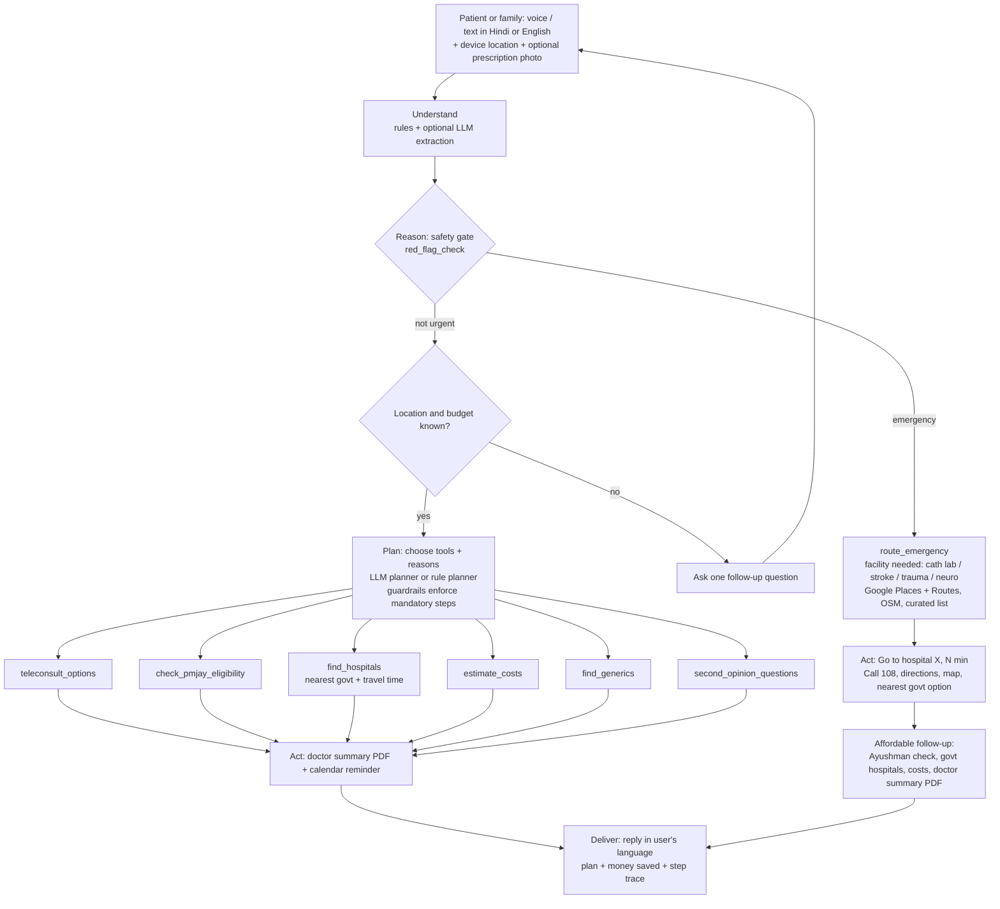

# Architecture

## Design choices
- **Safety is code, not prompt.** Red-flag detection is deterministic and always runs first. Each emergency maps to the facility it needs, so the patient is sent somewhere that can actually treat them.
- **Route, then keep helping.** Emergencies never wait for follow-up questions, and never end the conversation: the affordable follow-up plan is built underneath.
- **Maps with graceful fallback.** Google Maps Platform (Geocoding, Places, Routes) when a key is set; free OpenStreetMap otherwise; a curated government-hospital list with coordinates when offline. Directions links work with no key.
- **LLM optional.** Every step has a rule-based path, so the demo and API never fail on an outage. With a key, the LLM handles messy language, plans tool order, reads prescription photos and writes natural replies.
- **Guardrails over the planner.** Unknown tool names from the LLM are dropped; the safety check, emergency routing, summary and (non-urgent) reminder are always enforced.
- **Zero-infra.** Python standard library server + one dependency (reportlab).
